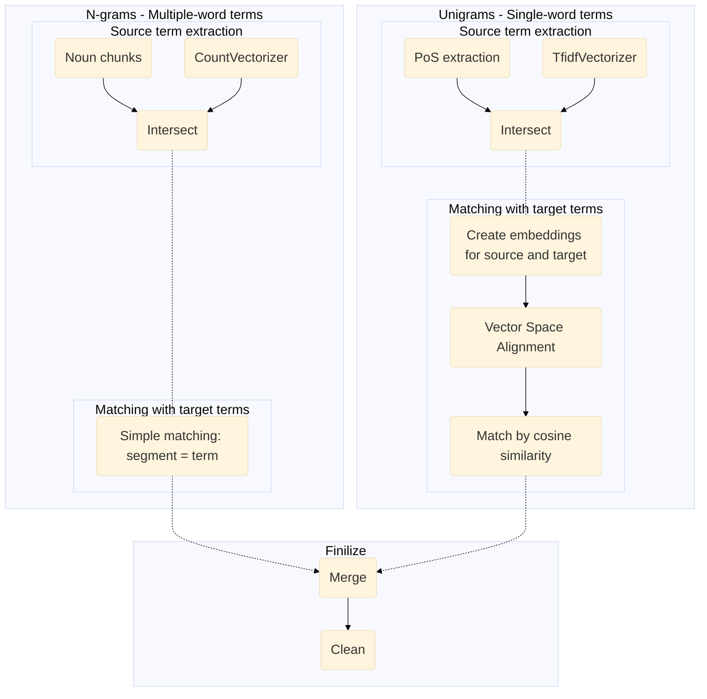


# Project Overview
## Building Bilingual Termbase from Parallel Corpus
### _HSE Coursework_

> This project is coursework for the Computational Linguistics Career Broadening Course at the HSE University in Moscow, Russia. It may serve as an example of the knowledge and skills I gained in the course, however, the project was not finalized or actually employed.

The purpose of this project was to build a viable bilingual glossary of terms for a certain translation project. In the future, this glossary would be used for training custom Machine Translation engines to translate the project.
The parallel corpus used for this programming project is a Translation Memory - human translations made with a [CAT tool](https://en.wikipedia.org/wiki/Computer-assisted_translation).
- Corpus size: 360,225 words (source) / 303,003 words (target) / 36,049 segments
- Source language: English
- Target language: Russian
- Field: mobile gaming

### System Layout

- _utility_file.py_ 
file containing module imports, a function for loading .csv, and a text preprocessing class
- _01_creating_embeddings.ipynb_ 
preprocessing the corpus and creating word embeddings
- _02_extracting_terminology.ipynb_
extracting unigram and n-gram terms (keywords and phrases) from the source corpus 
- _03_aligning_vector_spaces+finding_matches.ipynb_
aligning source and target vector spaces and finding matches for source unigram terms
- _04_finilizing_termbase.ipynb_
finding simple matches for the source n-gram terms, merging the results and exporting the termbase with an option to add terms manually 



## Usage
- Clone the repository
  ```sh
  git clone https://github.com/svetaku/Bilingual-Termbase.git
  cd Bilingual-Termbase
- Install dependencies
  ```sh
  pip install -r requirements.txt
- The dataset used for this project is not available in public domain. To run, use your own parallel EN-EU .csv dataset with English texts in the "source_lang" column, and Russian texts in the "target_lang" column
- Run the notebooks

